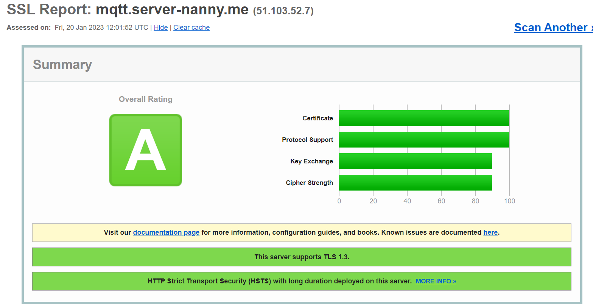

<h1 align="center">
   
	Server Nanny
</h1>
<h3 align="center">
  Application of Cloud of Things on Data Center Monitoring 
  Leave your servers in great hands ❤️‍🩹
</h3>

  <h4>
    <a href="#Context">Context</a> |
    <a href="#Live-Demo">Live Demo</a> |
    <a href="#Installation-Guide">Installation Guide</a> |
    <a href="#Technologies">Technologies</a> |
    <a href="#Certification-and-Grading">Certification and Grading</a> |
    <a href="#Further-Readings">Resources</a> |
  </h4>

 

## Context
The real-time monitoring of climate indicators and the prealable prevention of inconvenients are necessities for the proper functioning and sustainability of the equipments. Clearly, strategies must be put in place to reduce the likelihood of a fire, to alert staff that a fire is occurring, and to prevent from overheating or overcooling.

Our goals of this project are briefly: 
- To ensure availability by detecting hot spots in the racks.
- Save on cooling by safely increasing the temperature of the data center.
- Intervene instantly in case of a sudden fire.

We were able to :
- Concieve and realize a complete prototype of a datacenter monitoring system with the ability to connect and control it remotely.
- Use different Inner and Outer network technologies: APIs, MQTT.
- Use devices that are easy to install
- Assure scalability: adding new objects to the IoT network and integrating it in the control application is straightforward and easy.
## Live Demo
As for now, you can test the application by downloading the `.apk` file from the releases.
## Installation Guide

In order to  run and deploy the achieved work, follow these steps:

1- Install **JAVA-17** on your virtual machine

2- Install **MongoDB**

3- Install the package manager MAVEN

4- Clone the Repository :
 `git clone https://github.com/Eya-Gourar/Server-Nanny.git`

5- Go into api folder after that run `mvn clean install`

6- Go to the  **api folder** then target and take  **the nannay-1.0.war** `to widfly/standalone/deployment`  and then  start widfly 

7- Copy the **nanny.json** file inside the node red and then install it

8- In order to test the mobile application go  to **apk folder** and  download it and install the  application.

## Technologies
Multiple technologies, plugins, packages and hardware sensors and actuators were used while developing this project, the technologies are diverse and used for backend and frontend development.
- Middleware:
    - Wildfly preview 26.1.2 final
    - JDK 17.0.2

- IoT Backend:
  - Node RED
  - Communication protocols
  - Hardware:
    - Raspberry Pi 4
    - Sensor DHT22
    - Pi Camera

- MQTT Broker
  - Mosquitto Broker
- Frontend
  - Flutter
  - Other usefull flutter packages

## Certification and Grading
HTTPS was ensured using Let's Encrypt's Certbot, providing secure communication with the Middleware and the MQTT broker. DH (Diffie-Hellman parameters) parameters with 2048 bits are also used for TLS connections. In addition to that, some other security parameters were set on the widfly server to ensure max security.
The grading of the server was tested using [SSLlabs](https://www.ssllabs.com/), and we had a grade of A.

## Further Readings
You can find more information and take a look at the architecture design with the following documents:
-  [Scope Statement](docs/Design_Document___Eya_Gourar___Ramzi_Afli.pdf)
-  [Design Document](docs/Scope_Statement___Eya_Gourar___Ramzi_Afli.pdf)

